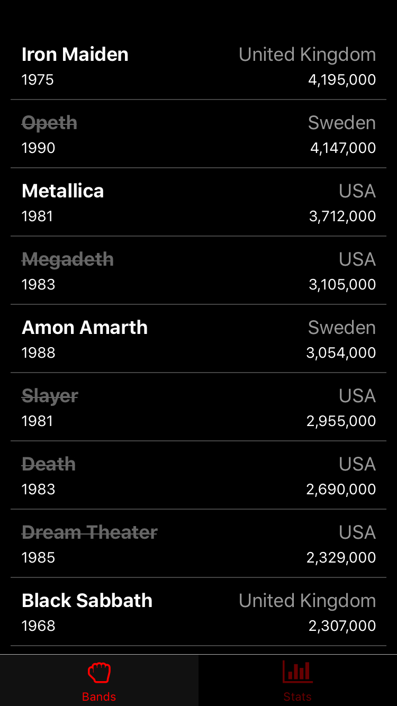
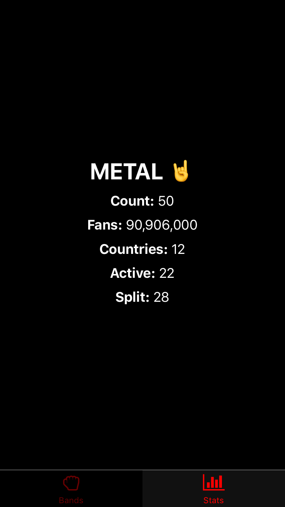

# FEW 2.4 Final Assessment

Metal fans need an app and you have to make it. Follow these steps to build the app. 

These images show what you would be making.





The core of the assessment is making the app. Save the styling and details for last. This will save you time as you work without wasting time solving problems that are not core to the app. For this reason, I recommend you solve the problems in the order listed here. 

## Challenge 1: React Native

Create a new React Native Project. It should be iOS compatible. I should be able to run it with Expo. 

## Challenge 2: Use React Navigation

The app should use a Tab Navigation with two tabs.

- Install required dependencies 
  - react-navigation and other 
  - bottom tabs
- Create a components for two screens
- Create a bottom tab navigator
- Set up your NavigationContainer
- Add your tab screens

## Challenge 3: Add icons

Add an icon to each tab on the bar. 

- Install your dependancies: react vector icons
- import your icon set
- Add icons to the tab bar

## Challenge 4: Band tab

Use the data from `metal.json`. This file contains stats describing the 50 most popular metal bands. 

In one tab screen display a list of all metal bands. Use FlatList.

- Import FlatList
- Import your data from `metal.json`
- Create a component to represent each row in the list. 

Each cell in the list should display: 

- Band Name
- Country of origin
- Number of fans
- Year formed

## Challenge 5: Format and Style band cell

Focus on the list cell now. It should show:

- Band Name
- Country of origin
- Number of fans
- Year formed

Look at the image. Your goal is to make yours look like the image. 

The Band Name and Year formed appears on the left and the country of origin and number of fans appears on the right. Use flex. 

Note: The number of fans is provided in thousands. You should multiply the number by 1000 and format it with commas. See the example image. For example: 

- 4,195,000

## Challenge 6: Stats Tab

This tab shows statistics from the data in `metal.json`. Use map, filter, and reduce to find the values displayed here!

Show the following: 

- **Total number of Bands**
- **Total metal fans** (this is the sum of all fans for each band)
- **Number of Countries represented**. You'll need to count each unique country found in all bands. 
- **Number of Active bands** (each band has a split property, this is "-" when a band is still active and shows the year they split if they broke up)
- **Number of bands that have split**

## Challenge 7: Style your work

Look at the images and try to match the general styles you see. 

- Basic styles
  - Background Color is #000
  - Text color is white #fff
- Tab bar Styles
  - Inactive Background color #000
  - active background color #111
  - active tint color #f00
  - inactive tint color #600
- Metal Stats
  - Color #fff
  - Title/Heading
    - font size 30
    - margin bottom 10
    - font weight bold
  - Labels
    - font size 18
    - font weight bold
  - values
    - font size 18
- Band List: Cell styles
  - Layout looks like the image
    - Band Name and formation date are on the left
    - Country of Origin and fans on the right
  - Band name and Countery name
    - font size 18
  - Fans
    - font size 12
  - origin
    - font size 18
    - color #999

## Challenge 8: Conditional styles

Some of the bands have splut up and are no longer active. You need to show this in the band cell in the list. Do it by adjusting the styles conditionally on the data. 

In each cell modify the styles of the name based on whether the band is split or active. A band that has split up will have a year in the "split" field for example: 

```JSON
...
"split": "1990"
...
```

Or it will show "-" if the band has not split. 

```JSON
...
"split": "-"
...
```

Style the band name: 

- For bands that have not split
  - color: #fff
  - font weight bold
- For bands that have split
  - color #666
  - text decoration line-through

## Challenge 9: Styles of Metal

Besides the wide array of interesting and creative bands names metal also has an interesting and creative range of sub genres. Your job is to find all of the all of the sub-genres. 

Each band has a "style" listed in the JSON data. You're goal is to count the unique styles. 

Display the count of unique metal styles on the Statictics screen. Something like: 

- **Styles:** 47

(It's notable that out of 50 bands there are 47 unqiue styles!)

## Challenge 10: List the Styles 

The goal of this challenge is to add a new tab screen and display all of the unique styles in a FlatList. 

- Create a new Tab Screen
- In the new screen Set up a FlatList that displays all of the unique styles

## Extra Credit 

- Add a search field at the top of the band list. Use it to filter the list of bands displayed by name. 