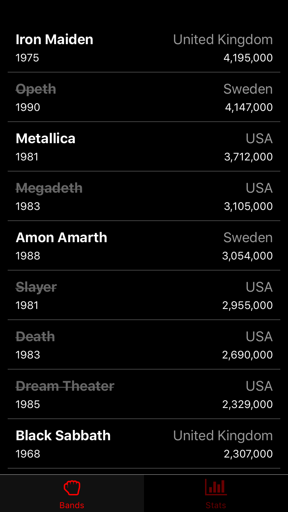
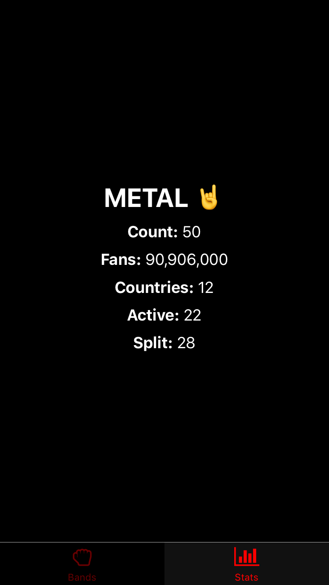

# FEW 2.4 Final Assessment

Metal fans need an app and you have to make it. Follow these steps to build the app. 

These images shows what you would be making (without anny extra credit problems). 

The core of the assessment is making the app. Save the styling and details for last. This will save you time as you work without wasting time solving problems that are worth fewer points. For this reason I recommend you solve the problems in the order listed here. 

## Step 1: React Native (15)

Create a new React Native Project.

## Step 2: Use React Navigation (15)

The app should use a Tab Navigation with two tabs.

Create a tabbed navigation.

Give Each tab an icon. You can use React Native Vector Icons for this. 

## Step 3: Band tab (20)

Use the data from `metal.json`. This file contains stats describing the 50 most popular metal bands. 

In one tab of your app display a list of all metal bands. Your list should show: 

- Band Name
- Country of origin
- Number of fans
- Year formed

Note: Number of fans is provided in thousands. You should multiply the number by a 1000 and format it with commas. See the example image.

Use FlatList. 

## Step 4: Stats Tab (15)

This tab shows stats from the data in `metal.json`. Use map, filter, and reduce to find the values displayed here!

Show the following: 

- Total number of Bands
- Total metal fans (this is the sum of all fans for each band)
- Number of Countries represented. You'll need to count each unique country found in all bands. 
- Number of Active bands (each band has a split property, this is "-" when a band is still active, and shows the year they split if they broke up)
- Number of bands that have split

## Step 5: Style your work (20)

Look at the images and try to match the general styles you see. 

- Basic styles (5)
  - Background Color is #000
  - Text color is white #fff
- Tab bar Styles (5)
  - Inactive Background color #000
  - active background color #111
  - active tint color #f00
  - inactive tine color #600
- Metal Stats (5)
  - Color #fff
  - Title/Heading
    - font size 30
    - margin bottom 10
    - font weight bold
  - Labels
    - font size 18
    - font weight bold
  - values
    - font size 18
- Band List Cell styles (5)
  - Layout looks like the image
    - Band Name and formation dyearate on the left
    - Country of Origin and fans on the right
  - Band name
    - font size 18
    - For bands that have not split
      - color: #fff
      - font weight bold
    - For bands that have split
      - color #666
      - text decoration line line-through
  - origin
    - font size 18
    - color #999

## Extra Credit 

Try as much of the extra credit as you like. I will award partial credit for work that is partially functional. This work may be hard for me to spot be sure to call it out with a comment! 

### Redux (15)

Use Redux and React Redux to show the selected band. Select the band by tapping it in the list view. Create a third tab that shows all of the stats for the selected band. 

- Actions 
	- Define an action `SELECT_BAND`
	- Define an action creator `selectBand(index)`
- Reducers 
	- Define a root reducer	
	- Define a band reducer
- Create the store 
- Use the Provider
- Connect a component to the store
	- Map your state to props (in the selected band view/component)
	- Map your action to props (in the band list view)

### More Extra credit (15)

Try any of the problems below. 

- Add a control (button, segmented control etc.) that sorts bands by: 
	- Name
	- Year formed
	- Country of origin
- Add a tab that shows 
	- Band with most fans
- Show the musical styles
	- Make a tab view 
	- Find all of the different musical styles represented in the data
	- List all of the unique styles 
	